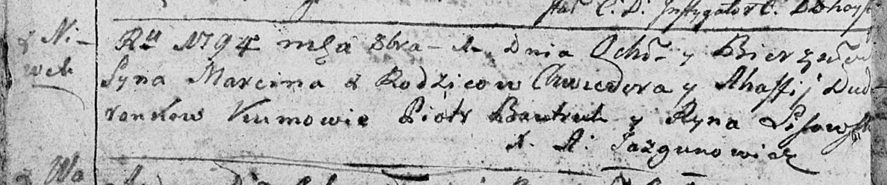

**Дударёнок Марцин Хведоров (Dudaronok Marcin)**

1 октября 1794 г -- крещение (НИАБ 136-13-894, лист 22об, №41/1794-р
(ориг)), (РГИА 823-2-18, лист 250об, №30/1794-р (коп)).

**НИАБ 136-13-894:** Лист 22об. **Метрическая запись №41/1794-р
(ориг).**

Дедиловичская Покровская церковь. 1 октября 1794 года. Метрическая
запись о крещении.

Dudaronek Marcin -- сын родителей с деревни Нивки.

Dudaronek Chwiedor -- отец.

Dudaronkowa Ahafija -- мать.

Bautruk Piotr - кум.

Lisowska Ryna - кума.

Jazgunowicz Antoni -- ксёндз.

**РГИА 823-2-18:** Лист 250об. **Метрическая запись №30/1794-р (коп).**

Дедиловичская Покровская церковь. 1 октября 1794 года. Метрическая
запись о крещении.

Dudaronek Marcin -- сын родителей с деревни Нивки.

Dudaronek Chwiedor -- отец.

Dudaronkowa Ahafija -- мать.

Bautruk Piotr -- кум.

Lisowska Jryna -- кума.

Jazgunowicz Antoni -- ксёндз.
