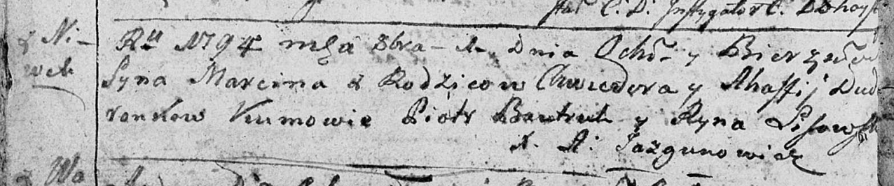

**Дударёнок Агапа (Dudaronkowa Ahapa)**

21 декабря 1791 г -- крещение сына Данилы (НИАБ 136-13-894, лист 14об,
№67/1791-р (ориг)), (РГИА 823-2-18, лист 243об, №35/1791-р (коп)).

1 октября 1794 г -- крещение сына Марцина (НИАБ 136-13-894, лист 22об,
№41/1794-р (ориг)), (РГИА 823-2-18, лист 250об, №30/1794-р (коп)).

8 июня 1796 г -- крещение сына Андрея (НИАБ 136-13-894, лист 29об,
№59/1796-р (ориг)), (РГИА 823-2-18, лист 256, №31/1796-р (коп)).

**НИАБ 136-13-894:** Лист 14-об. **Метрическая запись №67/1791-р
(ориг).**

{width="6.496527777777778in"
height="0.8837259405074366in"}

Дедиловичская Покровская церковь. 21 декабря 1791 года. Метрическая
запись о крещении.

Dudaronek Daniła -- сын родителей с деревни Нивки.

Dudaronek Chwiedor -- отец.

Dudaronkowa Ahapa -- мать.

Bautruk Piatruś - кум.

Lisowska Aryna - кума.

Jazgunowicz Antoni -- ксёндз.

**РГИА 823-2-18:** Лист 243об. **Метрическая запись №35/1791-р (коп).**

{width="6.496527777777778in"
height="1.354861111111111in"}

Дедиловичская Покровская церковь. 21 декабря 1791 года. Метрическая
запись о крещении.

Dudaronek Daniła -- сын родителей с деревни Нивки.

Dudaronek Chwiedor -- отец.

Dudaronkowa Ahapa-- мать.

Bautruk Piotr -- кум.

Lisowska Jryna - кума.

Jazgunowicz Antoni -- ксёндз.

**НИАБ 136-13-894:** Лист 22об. **Метрическая запись №41/1794-р
(ориг).**

{width="6.496527777777778in"
height="1.3591141732283465in"}

Дедиловичская Покровская церковь. 1 октября 1794 года. Метрическая
запись о крещении.

Dudaronek Marcin -- сын родителей с деревни Нивки.

Dudaronek Chwiedor -- отец.

Dudaronkowa Ahafija -- мать.

Bautruk Piotr - кум.

Lisowska Ryna - кума.

Jazgunowicz Antoni -- ксёндз.

**РГИА 823-2-18:** Лист 250об. **Метрическая запись №30/1794-р (коп).**

{width="6.496527777777778in"
height="1.6888888888888889in"}

Дедиловичская Покровская церковь. 1 октября 1794 года. Метрическая
запись о крещении.

Dudaronek Marcin -- сын родителей с деревни Нивки.

Dudaronek Chwiedor -- отец.

Dudaronkowa Ahafija -- мать.

Bautruk Piotr -- кум.

Lisowska Jryna -- кума.

Jazgunowicz Antoni -- ксёндз.

**НИАБ 136-13-894:** Лист 29-об. **Метрическая запись №59/1796-р
(ориг).**

{width="6.496527777777778in"
height="0.8186876640419948in"}

Дедиловичская Покровская церковь. 8 июня 1796 года. Метрическая запись о
крещении.

Dudaronok Andrzey -- сын родителей с деревни Нивки.

Dudaronok Teodor -- отец.

Dudaronkowa Ahapa -- мать.

Bautruk Piotr - кум.

Lisowska Jryna - кума.

Jazgunowicz Antoni -- ксёндз.

**РГИА 823-2-18:** Лист 256. **Метрическая запись №31/1796-р (коп).**

{width="6.496527777777778in"
height="1.7604166666666667in"}

Дедиловичская Покровская церковь. 8 июня 1796 года. Метрическая запись о
крещении.

Dudaronek Andrzey -- сын родителей с деревни Нивки.

Dudaronek Teodor -- отец.

Dudaronkowa Ahapa -- мать.

Bautruk Piotr -- кум.

Lisowska Jryna -- кума.

Jazgunowicz Antoni -- ксёндз.
