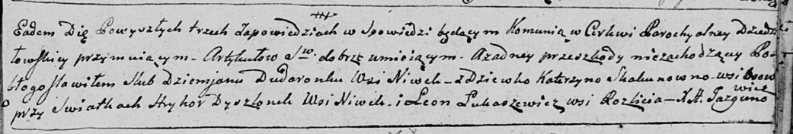

**Дышлёнок Грыгор (Dyszłonok Hryhor)**

10 февраля 1796 г -- свидетель венчания Демьяна Дударёнка с деревни
Нивки с Катерыной Скакун с деревни Осово (НИАБ 136-13-920, лист 3,
№7/1796-б (ориг)).

**НИАБ 136-13-920:** Лист 3. **Метрическая запись №7/1796-б (ориг).**

Дедиловичская Покровская церковь. 10 февраля 1796 года. Метрическая
запись о венчании.

Dudaronek Dziemjan -- жених, деревня Нивки.

Skakunowna Katerzyna -- невеста, деревня Осовo.

Dyszlonek Hryhor -- свидетель, деревня Нивки.

Łukaszewicz Leon -- свидетель, деревня Разлитье.

Jazgunowicz Antoni -- ксёндз.
