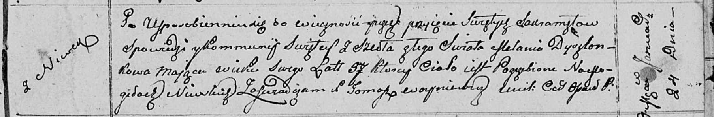

**Дышлёнок Мелания (Dyszlonkowa Mełania)**

24 января 1811 г -- отпевание, умерла в возрасте 37 лет (родилась около
1774 г) (НИАБ 136-13-919, лист 22, №2/1811-у (ориг)).

**НИАБ 136-13-919:** Лист 22. **Метрическая запись №2/1811-у (ориг).**

{width="6.496527777777778in"
height="1.0715277777777779in"}

Осовская униатская церковь. 24 января 1811 года. Метрическая запись об
отпевании.

Dyszlonkowa Mełania -- умершая, 37 лет, с деревни Нивки, похоронена на
кладбище деревни Нивки.

Woyniewicz Tomasz -- ксёндз.
