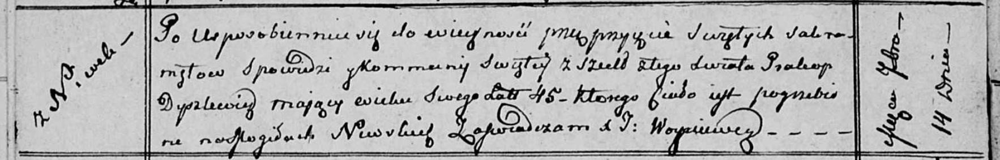

**Дышлёнок Пракоп (Dyszlewicz Prakop)**

14 сентября 1812 г -- отпевание, умер в возрасте 45 лет (родился около
1767 г) (НИАБ 136-13-919, лист 24об, №17/1812-у (ориг)).

**НИАБ 136-13-919:** Лист 24об. **Метрическая запись №17/1812-у
(ориг).**

{width="6.496527777777778in"
height="1.0409722222222222in"}

Осовская униатская церковь. 14 сентября 1812 года. Метрическая запись об
отпевании.

Dyszlewicz Prakop -- умерший, 45 лет, с деревни Нивки, похоронен на
кладбище деревни Нивки.

Woyniewicz Tomasz -- ксёндз.
