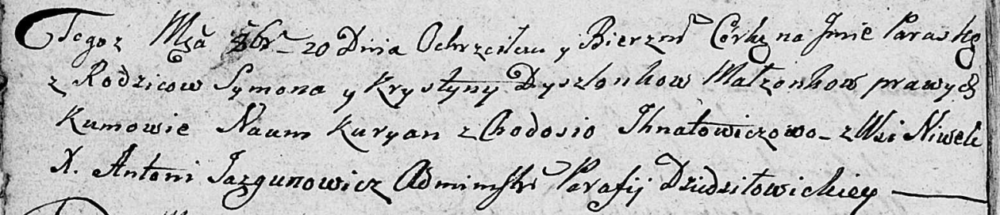

**Дышлёнок Параска Сымонова (Dyszlonkowna Paraska)**

20 октября 1808 г -- крещение дочери Параски (НИАБ 136-13-894, лист
72об, №37/1808-р (ориг)).

**НИАБ 136-13-894:** Лист 72об. **Метрическая запись №37/1808-р
(ориг).**

Дедиловичская Покровская церковь. 20 октября 1808 года. Метрическая
запись о крещении.

Dyszlonkowna Paraska -- дочь родителей с деревни Нивки.

Dyszlonak Symon -- отец.

Dyszlonkowa Krystyna -- мать.

Kuryan Naum -- кум.

Jhnatowiczowa Chodosia -- кума.

Jazgunowicz Antoni -- ксёндз.
