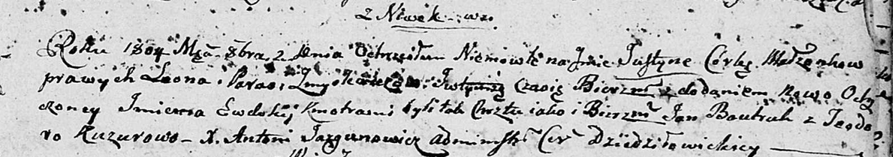

**Змыслевич Парася (Zmyslewiczowa Parasia)**

2 октября 1804 г -- крещение дочери Юстыны Евдокии (НИАБ 136-13-894,
лист 54, №41/1804-р (ориг)).

**НИАБ 136-13-894:** Лист 55. **Метрическая запись №41/1804-р (ориг).**

Дедиловичская Покровская церковь. 2 октября 1804 года. Метрическая
запись о крещении.

Zmyslewiczowna Justyna Ewdokija -- дочь родителей с деревни Нивки.

Zmyslewicz Leon -- отец.

Zmyslewiczowa Parasia -- мать.

Bautruk Jan -- кум.

Kuzurowa Teodora -- кума.

Jazgunowicz Antoni -- ксёндз.
