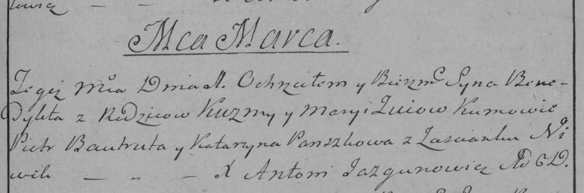

**Зуй Бенедыкт Кузьмов (Zuj Benedykt)**

1 марта 1786 г -- крещение (РГИА 823-2-18, лист 231, №8/1786-р (коп)).

**РГИА 823-2-18:** Лист 231. **Метрическая запись №8/1786-р (коп).**

Дедиловичская Покровская церковь. 1 марта 1786 года. Метрическая запись
о крещении.

Zuj Benedykt -- сын родителей с застенка Нивки.

Zuj Kuzma -- отец.

Zuiowa Marya -- мать.

Bautruta Piotr -- кум.

Pauszkowa Katarzyna - кума.

Jazgunowicz Antoni -- ксёндз.
