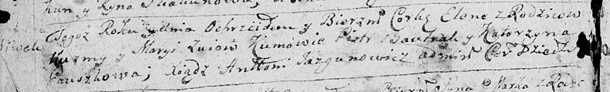
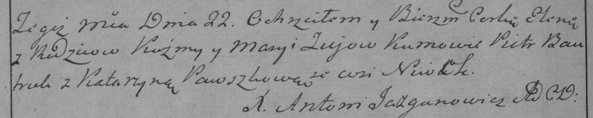

**Зуй Кузьма (Zuj Kuźma, Kuzma)**

1 марта 1786 г -- крещение сына Бенедыкта (РГИА 823-2-18, лист 231,
№8/1786-р (коп)).

21 марта 1787 г -- крещение дочери Елены (НИАБ 136-13-894, лист 1об,
№11/1787-р (ориг)), РГИА 823-18, лист 233об, №9/1787-р (коп)).

**РГИА 823-2-18:** Лист 231. **Метрическая запись №8/1786-р (коп).**

Дедиловичская Покровская церковь. 1 марта 1786 года. Метрическая запись
о крещении.

Zuj Benedykt -- сын родителей с застенка Нивки.

Zuj Kuzma -- отец.

Zuiowa Marya -- мать.

Bautruta Piotr -- кум.

Pauszkowa Katarzyna - кума.

Jazgunowicz Antoni -- ксёндз.

**НИАБ 136-13-894:** Лист 1об. **Метрическая запись №11/1787-р (ориг).**

Дедиловичская Покровская церковь. 21 марта 1787 года. Метрическая запись
о крещении.

Zuiowna Elena - дочь родителей с деревни Нивки.

Zuj Kuźma -- отец.

Zuiowa Maryia -- мать.

Bautruk Piotr - кум.

Pauszkowa Katerzyna - кума.

Jazgunowicz Antoni -- ксёндз.

**РГИА 823-2-18:** Лист 233об. **Метрическая запись №9/1787-р (коп).**

Дедиловичская Покровская церковь. 22 марта 1787 года. Метрическая запись
о крещении.

Zujowna Elena -- дочь родителей с деревни Нивки.

Zuj Kużma -- отец.

Zujowa Marya -- мать.

Bautruk Piotr -- кум.

Pauszkowa Katarzyna - кума.

Jazgunowicz Antoni -- ксёндз.
