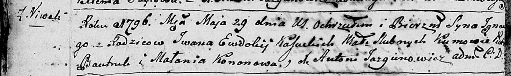
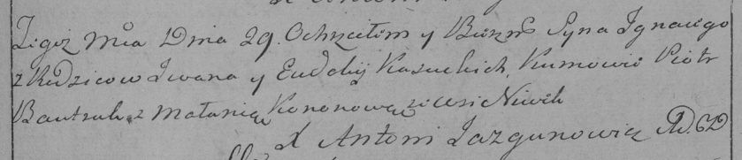

**Касуцкий Иван (Kasucki Jwan)**

29 мая 1796 г -- крещение сына Игнацего (НИАБ 136-13-894, лист 29об,
№57/1796-р (ориг)), (РГИА 823-2-18, лист 256, №29/1796-р (коп)).

**НИАБ 136-13-894:** Лист 29-об. **Метрическая запись №57/1796-р
(ориг).**

Дедиловичская Покровская церковь. 29 мая 1796 года. Метрическая запись о
крещении.

Kasucki Jgnacy -- сын родителей с деревни Нивки.

Kasucki Jwan -- отец.

Kasucka Ewdokija -- мать.

Bautruk Piotr - кум.

Kononowa Małanja - кума.

Jazgunowicz Antoni -- ксёндз.

**РГИА 823-2-18:** Лист 256. **Метрическая запись №29/1796-р (коп).**

Дедиловичская Покровская церковь. 29 мая 1796 года. Метрическая запись о
крещении.

Kasucki Jgnacy -- сын родителей с деревни Нивки.

Kasucki Jwan -- отец.

Kasucka Eudokija -- мать.

Bautruk Piotr -- кум.

Kononowa Małania -- кума.

Jazgunowicz Antoni -- ксёндз.
