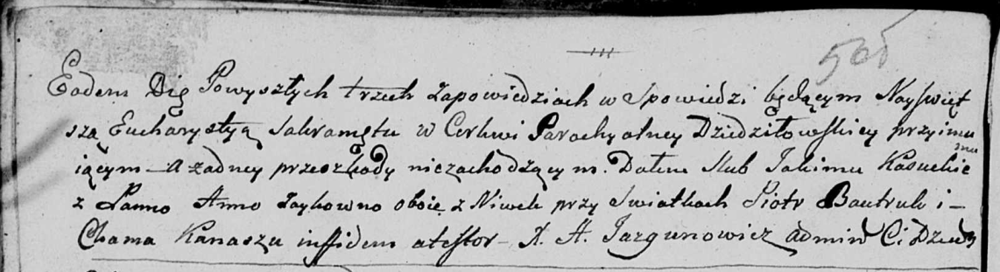
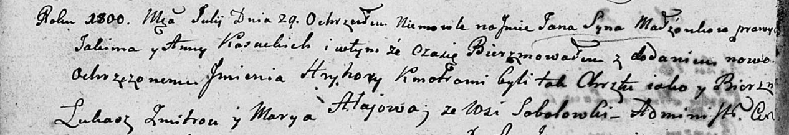
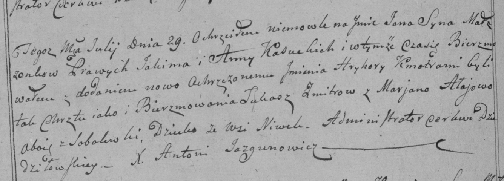
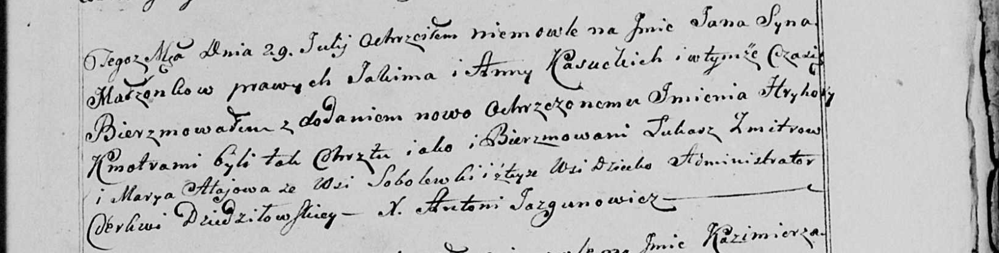
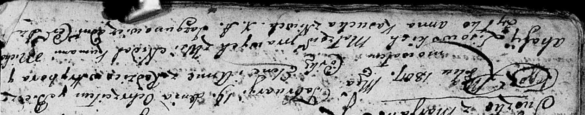
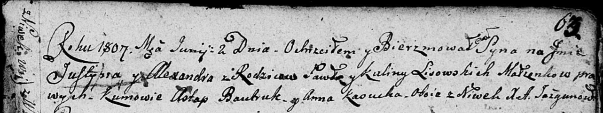
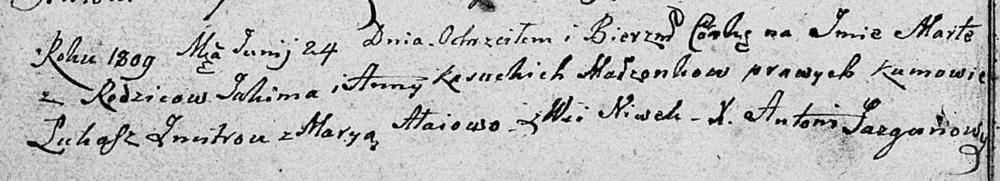

**Касуцкая (Зайковская) Анна (Kasucka (Zaykowna) Anna)**

24 января 1798 г -- венчание с Якимом Касуцким с деревни Нивки (НИАБ
136-13-920, лист 5об, №4/1798-б (ориг)).

29 июля 1800 г -- крещение сына Яна Грыгора (НИАБ 136-13-894, лист 41об,
№20/1800-р (ориг), РГИА 823-2-18, лист 276об, №19/1800-р (коп), НИАБ
136-13-949, лист 103, №22/1800-р (коп)).

19 февраля 1807 г -- крестная мать Елены Анны, дочери Лисичёнков
Грыгорыя и Агафии с деревни Недаль (НИАБ 136-13-894, лист 61об,
№6/1807-р (ориг)).

2 июня 1807 г -- крестная мать у Юстыния Александра, сына Лисичёнков
Павла и Кулины с деревни Нивки (НИАБ 136-13-894, лист 63, №28/1807-р
(ориг)).

24 июня 1809 г -- крещение дочери Марты (НИАБ 136-13-894, лист 74об,
№31/1809-р (ориг)).

**НИАБ 136-13-920:** Лист 5об. **Метрическая запись №4/1798-б (ориг).**

Дедиловичская Покровская церковь. 24 января 1798 года. Метрическая
запись о венчании.

Kasucki Jakim -- жених, деревня Нивки.

Zaykowna Anna -- невеста, деревня Нивки.

Bautruk Piotr -- свидетель.

Kanasz Chama -- свидетель.

Jazgunowicz Antoni -- ксёндз.

**НИАБ 136-13-894:** Лист 41об. **Метрическая запись №20/1800-р
(ориг).**

Дедиловичская Покровская церковь. 29 июля 1800 года. Метрическая запись
о крещении.

Kasucki Jan Hryhory -- сын родителей с деревни \[Нивки\].

Kasucki Jakim -- отец.

Kasucka Anna -- мать.

Zmitrok Łukasz -- кум.

Ałajowa Marya -- кума, с деревни Соболевка.

Jazgunowicz Antoni -- ксёндз.

**РГИА 823-2-18:** Лист 276об. **Метрическая запись №19/1800-р (коп).**

Дедиловичская Покровская церковь. 29 июля 1800 года. Метрическая запись
о крещении.

Kasucki Jan Hryhory -- сын родителей с деревни Нивки.

Kasucki Jakim -- отец.

Kasucka Anna -- мать.

Zmitrow Łukasz -- кум, с деревни Соболевка.

Ałajowa Marjana -- кума, с деревни Соболевка.

Jazgunowicz Antoni -- ксёндз.

**НИАБ 136-13-949:** Лист 103. **Метрическая запись №22/1800-р (коп).**

(См. тж.: РГИА 823-2-18, лист 276об, №19/1800-р (коп), НИАБ 136-13-894,
лист 41об, №20/1800-р (ориг))

Дедиловичская Покровская церковь. 29 июля 1800 года. Метрическая запись
о крещении.

Kasucki Jan Hryhorу -- сын родителей с деревни Соболевка \[Нивки\].

Kasucki Jakim -- отец.

Kasucka Anna -- мать.

Zmitrow Łukasz -- кум.

Ałajowa Marya - кума, с деревни Соболевка.

Jazgunowicz Antoni -- ксёндз.

**НИАБ 136-13-894:** Лист 61об. **Метрическая запись №6/1807-р (ориг).**

Дедиловичская Покровская церковь. 19 февраля 1807 года. Метрическая
запись о крещении.

Lisowska Elena Anna -- дочь родителей с деревни Недаль.

Lisowski Hryhor -- отец.

Lisowska Ahafija -- мать.

Żyłko Michał -- кум.

Kasucka Anna -- кума, с деревни Нивки.

Jazgunowicz Antoni -- ксёндз.

**НИАБ 136-13-894:** Лист 63. **Метрическая запись №28/1807-р (ориг).**

Дедиловичская Покровская церковь. 2 июня 1807 года. Метрическая запись о
крещении.

Lisowski Justynij Alexander -- сын родителей с деревни Нивки.

Lisowski Paweł -- отец.

Lisowska Kulina -- мать.

Bautruk Astap -- кум, с деревня Нивки.

Kasucka Anna -- кума, деревня Нивки.

Jazgunowicz Antoni -- ксёндз.

**НИАБ 136-13-894:** Лист 74об. **Метрическая запись №31/1809-р
(ориг).**

Дедиловичская Покровская церковь. 24 июня 1809 года. Метрическая запись
о крещении.

Kasucka Marta -- дочь родителей с деревни Нивки.

Kasucki Jakim -- отец.

Kasucka Anna -- мать.

Zmitrok Łukasz -- кум.

Ałaiowa Marya -- кума.

Jazgunowicz Antoni -- ксёндз.
