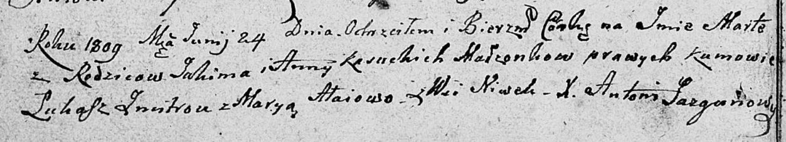

**Касуцкая Марта Якимова (Kasucka Marta)**

24 июня 1809 г -- крещение (НИАБ 136-13-894, лист 74об, №31/1809-р
(ориг)).

**НИАБ 136-13-894:** Лист 74об. **Метрическая запись №31/1809-р
(ориг).**

{width="6.496527777777778in"
height="1.1821008311461068in"}

Дедиловичская Покровская церковь. 24 июня 1809 года. Метрическая запись
о крещении.

Kasucka Marta -- дочь родителей с деревни Нивки.

Kasucki Jakim -- отец.

Kasucka Anna -- мать.

Zmitrok Łukasz -- кум.

Ałaiowa Marya -- кума.

Jazgunowicz Antoni -- ксёндз.
