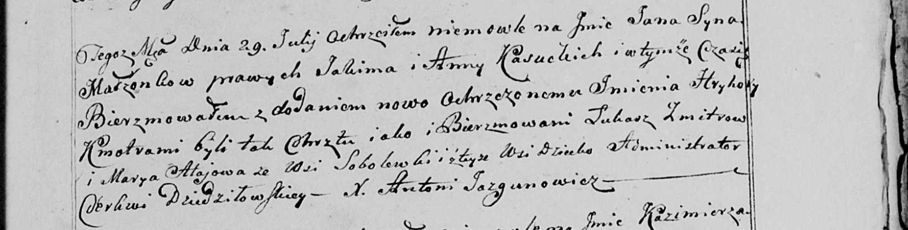

**Касуцкий Ян Якимов (Kasucki Jan Hryhory)**

29 июля 1800 г -- крещение сына Яна Грыгора (НИАБ 136-13-894, лист 41об,
№20/1800-р (ориг), РГИА 823-2-18, лист 276об, №19/1800-р (коп), НИАБ
136-13-949, лист 103, №22/1800-р (коп)).

**НИАБ 136-13-894:** Лист 41об. **Метрическая запись №20/1800-р
(ориг).**

{width="6.496527777777778in"
height="1.1137095363079614in"}

Дедиловичская Покровская церковь. 29 июля 1800 года. Метрическая запись
о крещении.

Kasucki Jan Hryhory -- сын родителей с деревни \[Нивки\].

Kasucki Jakim -- отец.

Kasucka Anna -- мать.

Zmitrok Łukasz -- кум.

Ałajowa Marya -- кума, с деревни Соболевка.

Jazgunowicz Antoni -- ксёндз.

**РГИА 823-2-18:** Лист 276об. **Метрическая запись №19/1800-р (коп).**

{width="6.496527777777778in"
height="2.3340277777777776in"}

Дедиловичская Покровская церковь. 29 июля 1800 года. Метрическая запись
о крещении.

Kasucki Jan Hryhory -- сын родителей с деревни Нивки.

Kasucki Jakim -- отец.

Kasucka Anna -- мать.

Zmitrow Łukasz -- кум, с деревни Соболевка.

Ałajowa Marjana -- кума, с деревни Соболевка.

Jazgunowicz Antoni -- ксёндз.

**НИАБ 136-13-949:** Лист 103. **Метрическая запись №22/1800-р (коп).**

(См. тж.: РГИА 823-2-18, лист 276об, №19/1800-р (коп), НИАБ 136-13-894,
лист 41об, №20/1800-р (ориг))

{width="6.496527777777778in"
height="1.6444444444444444in"}

Дедиловичская Покровская церковь. 29 июля 1800 года. Метрическая запись
о крещении.

Kasucki Jan Hryhorу -- сын родителей с деревни Соболевка \[Нивки\].

Kasucki Jakim -- отец.

Kasucka Anna -- мать.

Zmitrow Łukasz -- кум.

Ałajowa Marya - кума, с деревни Соболевка.

Jazgunowicz Antoni -- ксёндз.
