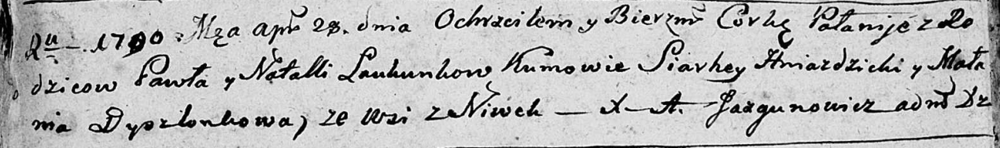

**Лавкун Наталья (Łaukunowa, Łaukunkowa Natalla)**

4 апреля 1787 г -- крещение сына Никиты (НИАБ 136-13-894, лист 1об,
№14/1787-р (ориг)).

28 апреля 1790 г -- крещение дочери Паланеи (НИАБ 136-13-894, лист 9об,
№28/1790-р (ориг)).

**НИАБ 136-13-894:** Лист 1об. **Метрическая запись №14/1787-р (ориг).**

Дедиловичская Покровская церковь. 4 апреля 1787 года. Метрическая запись
о крещении.

Łaukun Nikita -- сын родителей с деревни Нивки.

Łaukun Pawel -- отец.

Łaukunowa Natalla -- мать.

Hniazdzicki Sierhey - кум.

Dyszlonkowa Malanija - кума.

Jazgunowicz Antoniusz -- ксёндз.

**НИАБ 136-13-894:** Лист 9об. **Метрическая запись №28/1790-р (ориг).**

Дедиловичская Покровская церковь. 28 апреля 1790 года. Метрическая
запись о крещении.

Łaukunkowna Pałanija -- дочь родителей с деревни Нивки.

Łaukunok Paweł -- отец.

Łaukunkowa Natalla -- мать.

Hniazdzicki Siarhey - кум.

Dyszlonkowa Małania - кума.

Jazgunowicz Antoni -- ксёндз.
