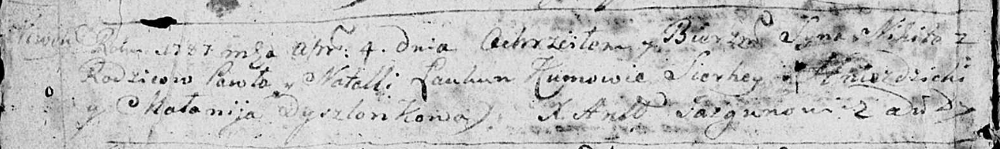

**Лавкун Никита Павлов (Łaukun Nikita)**

4 апреля 1787 г -- крещение (НИАБ 136-13-894, лист 1об, №14/1787-р
(ориг)).

**НИАБ 136-13-894:** Лист 1об. **Метрическая запись №14/1787-р (ориг).**

Дедиловичская Покровская церковь. 4 апреля 1787 года. Метрическая запись
о крещении.

Łaukun Nikita -- сын родителей с деревни Нивки.

Łaukun Pawel -- отец.

Łaukunowa Natalla -- мать.

Hniazdzicki Sierhey - кум.

Dyszlonkowa Malanija - кума.

Jazgunowicz Antoniusz -- ксёндз.
