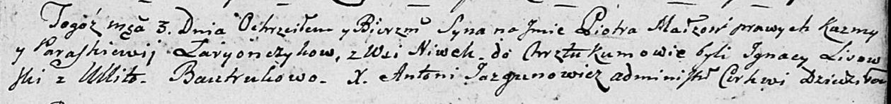

**Лариончик Параскевия (Łaryonczykowa Paraskiewija)**

3 июля 1804 г -- крещение сына Петра (НИАБ 136-13-894, лист 54,
№20/1804-р (ориг)).

**НИАБ 136-13-894:** Лист 54. **Метрическая запись №20/1804-р (ориг).**

Дедиловичская Покровская церковь. 3 июля 1804 года. Метрическая запись о
крещении.

Łaryonczyk Piotr -- сын родителей с деревни Нивки.

Łaryonczyk Kuźma -- отец.

Łaryonczyk Paraskiewija -- мать.

Lisowski Jhnacy -- кум.

Bautrukowa Ullita -- кума.

Jazgunowicz Antoni -- ксёндз.
