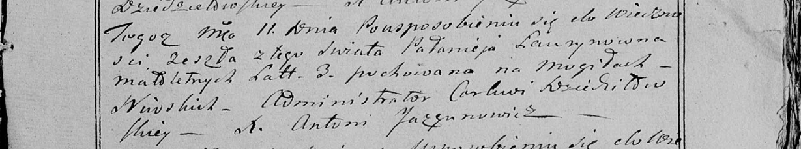

**Лариончик Полонея (Łarywonczyca Pałanieja)**

11 февраля 1799 г -- отпевание, умерла в возрасте 3 лет (родилась около
1796 г) (НИАБ 136-13-919, лист 8об, №4/1799-у (ориг), НИАБ 136-13-938,
лист 250, №4/1799-у (коп)).

**НИАБ 136-13-919:** Лист 8об. **Метрическая запись №4/1799-у (ориг).**

Дедиловичская Покровская церковь. 11 февраля 1799 года. Метрическая
запись об отпевании.

Łarywonczyca Pałanieja -- умершая, 3 года, с деревни Нивки, похоронена
на кладбище деревни Нивки.

Jazgunowicz Antoni -- ксёндз.

**НИАБ 136-13-938:** Лист 250. **Метрическая запись №4/1799-у (коп).**

(См. тж. НИАБ 136-13-919, Лист 8об. Метрическая запись №4/1799-у (ориг))

Дедиловичская Покровская церковь. 11 февраля 1799 года. Метрическая
запись об отпевании.

Łaurynowna Pałanieja -- умершая, 3 года, с деревни \[Нивки\], похоронена
на кладбище деревни Нивки.

Jazgunowicz Antoni -- ксёндз.
