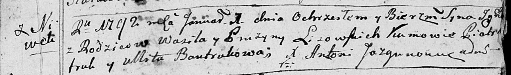
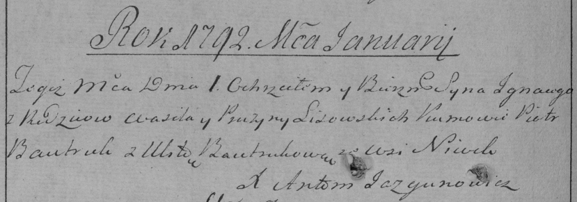

**Лисичёнок Игнацы Василев (Lisowski Jgnacy)**

1 января 1792 г -- крещение (НИАБ 136-13-894, лист 15, №5/1792-р
(ориг)), (РГИА 823-2-18, лист 243об, №1/1792-р (коп)).

**НИАБ 136-13-894:** Лист 15. **Метрическая запись №5/1792-р (ориг).**

Дедиловичская Покровская церковь. 1 января 1792 года. Метрическая запись
о крещении.

Lisowski Jgnacy -- сын родителей с деревни Нивки.

Lisowski Wasil -- отец.

Lisowska Pruzyna -- мать.

Bautruk Piotr -- кум.

Bautrukowa Ullita - кума.

Jazgunowicz Antoni -- ксёндз.

**РГИА 823-2-18:** Лист 243об. **Метрическая запись №1/1792-р (коп).**

Дедиловичская Покровская церковь. 1 января 1792 года. Метрическая запись
о крещении.

Lisowski Jgnacy -- сын родителей с деревни Нивки.

Lisowski Wasil -- отец.

Lisowska Pruzyna -- мать.

Bautruk Piotr -- кум.

Bautrukowa Ulita - кума.

Jazgunowicz Antoni -- ксёндз.
