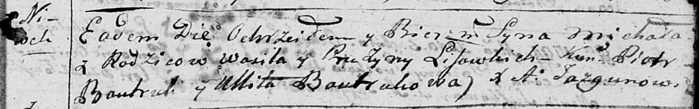
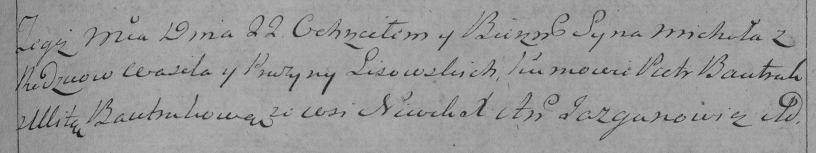

**Лисичёнок Михал Василев (Lisowski Michał)**

22 октября 1794 г -- крещение (НИАБ 136-13-894, лист 23, №47/1794-р
(ориг)), (РГИА 823-2-18, лист 251, №33/1794-р (коп)).

**НИАБ 136-13-894:** Лист 23. **Метрическая запись №47/1794-р (ориг).**

Дедиловичская Покровская церковь. 22 октября 1794 года. Метрическая
запись о крещении.

Lisowski Michał -- сын родителей с деревни Нивки.

Lisowski Wasil -- отец.

Lisowska Pruzyna -- мать.

Bautruk Piotr - кум.

Bautrukowa Ullita - кума.

Jazgunowicz Antoni -- ксёндз.

**РГИА 823-2-18:** Лист 251. **Метрическая запись №33/1794-р (коп).**

Дедиловичская Покровская церковь. 22 октября 1794 года. Метрическая
запись о крещении.

Lisowski Michał -- сын родителей с деревни Нивки.

Lisowski Wasil -- отец.

Lisowska Pruzyna -- мать.

Bautruk Piotr -- кум.

Bautrukowa Ulita -- кума.

Jazgunowicz Antoni -- ксёндз.
