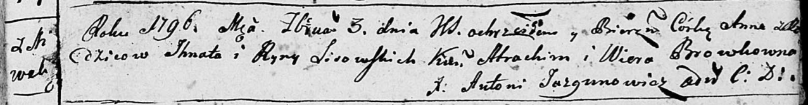

**Лисичёнок Анна Игнатова (Lisowska Anna)**

3 февраля 1796 г -- крещение (НИАБ 136-13-894, лист 28, №16/1796-р
(ориг)).

Лист 28. **Метрическая запись №16/1796-р (ориг).**

Дедиловичская Покровская церковь. 3 февраля 1796 года. Метрическая
запись о крещении.

Lisowska Anna -- дочь родителей с деревни Нивки.

Lisowski Jhnat -- отец.

Lisowska Ryna -- мать.

Atrachim - кум.

Browkowna Wiera - кума.

Jazgunowicz Antoni -- ксёндз.
