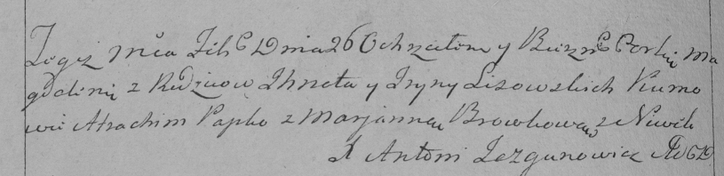

**Лисичёнок Магдалена Игнатова (Lisowska Magdalеna)**

26 февраля 1794 г -- крещение (НИАБ 136-13-894, лист 21об, №11/1794-р
(ориг)), (РГИА 823-2-18, лист 249об, №7/1794-р (коп)).

Лист 21об. **Метрическая запись №11/1794-р (ориг).**

{width="6.496527777777778in"
height="1.0768318022747156in"}

Дедиловичская Покровская церковь. 26 февраля 1794 года. Метрическая
запись о крещении.

Lisowska Magdalena -- дочь родителей с деревни Нивки.

Lisowski Jhnat -- отец.

Lisowska Ryna -- мать.

Papko Atrachim - кум.

Browkowa Marjana - кума.

Jazgunowicz Antoni -- ксёндз.

**РГИА 823-2-18:** Лист 249об. **Метрическая запись №7/1794-р (коп).**

{width="6.496527777777778in"
height="1.5784722222222223in"}

Дедиловичская Покровская церковь. 26 февраля 1794 года. Метрическая
запись о крещении.

Lisowska Magdalena -- дочь родителей с деревни Нивки.

Lisowski Jhnat -- отец.

Lisowska jryna -- мать.

Papko Atrachim -- кум.

Browkowa Marjanna -- кума.

Jazgunowicz Antoni -- ксёндз.
