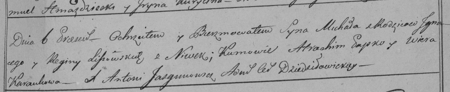

**Лисичёнок Михал Игнатов (Lisowski Michał)**

6 июня 1798 г -- крещение (НИАБ 136-13-894, лист 36, №23/1798-р (ориг)),
(РГИА 823-2-18, лист 264, №23/1798-р (коп)).

Лист 36. **Метрическая запись №23/1798-р (ориг).**

{width="6.496527777777778in"
height="1.1633267716535434in"}

Дедиловичская Покровская церковь. 6 июня 1798 года. Метрическая запись о
крещении.

Lisowski Michał -- сын родителей с деревни Нивки.

Lisowski Jgnacy -- отец.

Lisowska Ryna -- мать.

Papko Atrachim - кум.

Karańkowa Wiera - кума.

Jazgunowicz Antoni -- ксёндз.

**РГИА 823-2-18:** Лист 264. **Метрическая запись №23/1798-р (коп).**

{width="6.496527777777778in"
height="1.336111111111111in"}

Дедиловичская Покровская церковь. \[6\] июня 1798 года. Метрическая
запись о крещении.

Lisowski Michał -- сын родителей с деревни Нивки.

Lisowski Jgnacy -- отец.

Lisowska Regina -- мать.

Papko Atrachim -- кум.

Karańkowa Wiera -- кума.

Jazgunowicz Antoni -- ксёндз.
