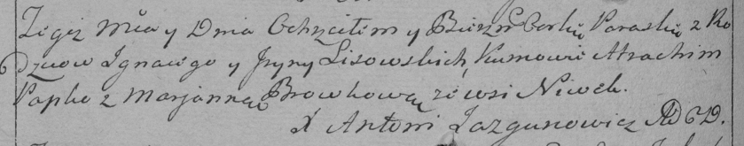

**Лисичёнок Параска (Lisowska Paraska)**

14 октября 1789 г -- крещение (НИАБ 136-13-894, лист 8, №54/1789-р
(ориг)), (РГИА 823-2-18, лист 238об, №25/1789-р (коп)).

**НИАБ 136-13-894:** Лист 8. **Метрическая запись №54/1789-р (ориг).**

{width="6.496527777777778in"
height="1.015145450568679in"}

Дедиловичская Покровская церковь. 14 октября 1789 года. Метрическая
запись о крещении.

Lisowska Paraska -- дочь родителей с деревни Нивки.

Lisowski Jhnat -- отец.

Lisowska Ryna -- мать.

Papko Atrachim - кум.

Browkowa Marjana - кума.

Jazgunowicz Antoni -- ксёндз.

**РГИА 823-2-18:** Лист 238об. **Метрическая запись №25/1789-р (коп).**

{width="6.496527777777778in"
height="1.2777777777777777in"}

Дедиловичская Покровская церковь. 14 октября 1789 года. Метрическая
запись о крещении.

Lisowska Paraska -- дочь родителей с деревни Нивки.

Lisowski Jgnacy -- отец.

Lisowska Jryna -- мать.

Papko Atrachim -- кум.

Browkowa Marjanna - кума.

Jazgunowicz Antoni -- ксёндз.
