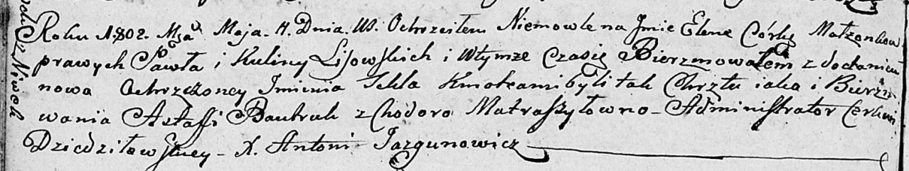

**Лисичёнок Елена Павлова (Lisowska Elena Tekla)**

11 мая 1802 г -- крещение (НИАБ 136-13-894, лист 46об, №15/1802-р
(ориг)).

**НИАБ 136-13-894:** Лист 46об. **Метрическая запись №15/1802-р
(ориг).**

Дедиловичская Покровская церковь. 11 мая 1802 года. Метрическая запись о
крещении.

Lisowska Elena Tekla -- дочь родителей с деревни Нивки.

Lisowski Pawel -- отец.

Lisowska Kulina -- мать.

Bautruk Astafi -- кум.

Matraszyłowna Chodora -- кума.

Jazgunowicz Antoni -- ксёндз.
