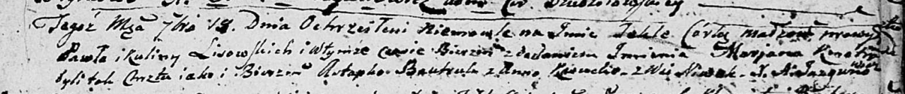

**Лисичёнок Текля Павлова (Lisowska Tekla Marjana)**

19 сентября 1804 г -- крещение (НИАБ 136-13-894, лист 55, №38/1804-р
(ориг)).

**НИАБ 136-13-894:** Лист 55. **Метрическая запись №38/1804-р (ориг).**

Дедиловичская Покровская церковь. 19 сентября 1804 года. Метрическая
запись о крещении.

Lisowska Tekla Marjana -- дочь родителей с деревни Нивки.

Lisowski Paweł -- отец.

Lisowska Kulina -- мать.

Bautruk Astapka -- кум.

Kasucka Anna -- кума.

Jazgunowicz Antoni -- ксёндз.
