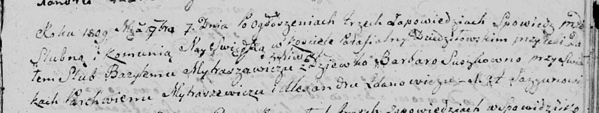

**Матрашило (в девичестве Сушко) Варвара (Mytraszewiczowa,
Matrasewiczowa Barbara z Suszkow)**

7 ноября 1809 г -- венчание с Базылём Матрашило с деревни Нивки (НИАБ
136-13-920, лист 16, №18/1809-б (ориг)).

Апрель -- октябрь 1810 г -- крещение дочери Марии (НИАБ 937-4-32, лист
22, №14/1810-р).

**НИАБ 136-13-920:** Лист 16. **Метрическая запись №18/1809-б (ориг).**

Дедиловичская Покровская церковь. 7 ноября 1809 года. Метрическая запись
о венчании.

Mytraszewicz Bazyli -- жених, с деревни Нивки.

Suszkowna Barbara -- невеста, девка.

Mytraszewicz Parchwien -- свидетель.

Żdanowicz Alexander -- свидетель.

Jazgunowicz Antoni -- ксёндз.

**НИАБ 937-4-32:** Лист 22. **Метрическая запись №14/1810-р.**

Дедиловичский костел Наисвятейшего Сердца Иисуса. Апрель -- октябрь 1810
года. Метрическая запись о крещении.

Matrasewiczowna Maria -- дочь крестьян с деревни Нивки.

Matrasewicz Basilio -- отец.

Matrasewiczowa Barbara -- мать.

Szpet Stephan -- крестный отец.

Komisionkowa Elisobetha -- крестная мать, с деревни Дедиловичи.

Zychowski Gabriel -- ксёндз.
