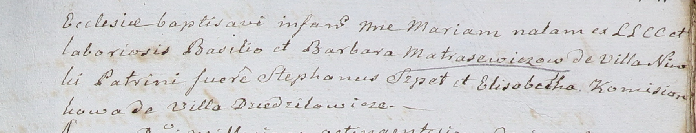

**Матрашило Мария Базылева (Matrasewiczowa Maria)**

Апрель -- октябрь 1810 г -- крещение (НИАБ 937-4-32, лист 22,
№14/1810-р).

**НИАБ 937-4-32:** Лист 22. **Метрическая запись №14/1810-р.**

{width="6.496527777777778in"
height="1.2416666666666667in"}

Дедиловичский костел Наисвятейшего Сердца Иисуса. Апрель -- октябрь 1810
года. Метрическая запись о крещении.

Matrasewiczowna Maria -- дочь крестьян с деревни Нивки.

Matrasewicz Basilio -- отец.

Matrasewiczowa Barbara -- мать.

Szpet Stephan -- крестный отец.

Komisionkowa Elisobetha -- крестная мать, с деревни Дедиловичи.

Zychowski Gabriel -- ксёндз.
