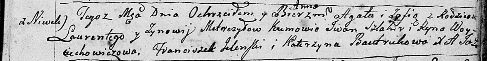
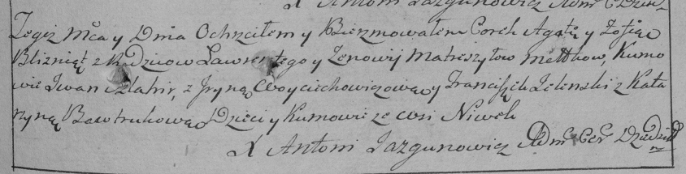
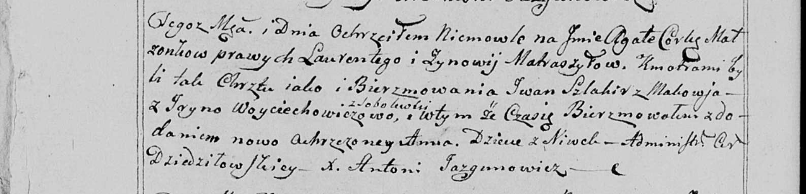

**Матрашило Агата Лаврынова (Matryszyłowna Agata Anna)**

10 февраля 1799 г -- крещение (НИАБ 136-13-894, лист 38, №7/1799-р
(ориг)), (РГИА 823-2-18, лист 268, №7/1799-р (коп), НИАБ 136-13-938,
лист 240об, №7/1799-р (коп)).

**НИАБ 136-13-894:** Лист 38. **Метрическая запись №7/1799-р (ориг).**

Дедиловичская Покровская церковь. 10 февраля 1799 года. Метрическая
запись о крещении.

Metreszyłowna Agata Anna -- дочь родителей с деревни Нивки.

Metreszyłowna Zofia -- дочь родителей с деревни Нивки.

Metreszyło Łaurenty -- отец.

Metreszyłowa Zynowija -- мать.

Szlahir Jwan -- кум, кретный отец Агаты Анны.

Woyciechowiczowa Ryna -- кума, крестная мать Агаты Анны.

Elenski Franciszek -- кум, крестный отец Зофии.

Bautrukowa Katerzyna -- кума, крестная мать Зофии.

Jazgunowicz Antoni -- ксёндз.

**РГИА 823-2-18:** Лист 268. **Метрическая запись №7/1799-р (коп).**

Дедиловичская Покровская церковь. 10 февраля 1799 года. Метрическая
запись о крещении.

Matreszyłowna Agata -- дочь родителей с деревни Нивки.

Matreszyłowna Zofia -- дочь родителей с деревни Нивки.

Matreszyło Ławrenty -- отец.

Matreszyłowa Zienowija -- мать.

Szlachir Jwan -- кум.

Woyciechowiczowa Jryna -- кума.

Jelenski Franciszek -- кум.

Bautrukowa Katarzyna -- кума.

Jazgunowicz Antoni -- ксёндз.

**НИАБ 136-13-938:** Лист 240об. **Метрическая запись №7/1799-р (коп).**

(См. тж. НИАБ 136-13-894, лист 38, №7/1799-р (ориг); РГИА 823-2-18, лист
268, №7/1799-р (коп))

Дедиловичская Покровская церковь. 10 февраля 1799 года. Метрическая
запись о крещении.

Matraszyłowa Agata Anna -- дочь родителей с деревни Нивки.

Matraszyło Łaurenty -- отец.

Matraszyłowa Zynowija -- мать.

Szlahir Jwan -- кум, с деревни Маковье.

Woyciechowiczowa Jryna - кума, с деревни Соболевка.

Jazgunowicz Antoni -- ксёндз.
