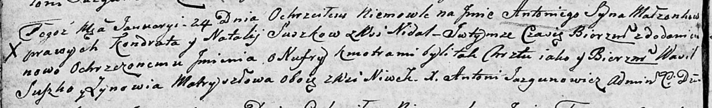

**Матрашило Ева Лаврынова (Matryszyłowna Ewa)**

4 мая 1796 г -- крещение (НИАБ 136-13-894, лист 29, №51/1796-р (ориг)).

**НИАБ 136-13-894:** Лист 29. **Метрическая запись №51/1796-р (ориг).**

{width="6.496527777777778in"
height="0.8944542869641294in"}

Дедиловичская Покровская церковь. 4 мая 1796 года. Метрическая запись о
крещении.

Matraszyłowna Ewa -- дочь родителей с деревни Нивки.

Matraszyło Ławryn -- отец.

Matraszyłowa Zynowija -- мать.

Szlakir Markо - кум.

Buzowa Aryna - кума.

Butwilowski Lukasz -- ксёндз, капеллан Мстижской церкви.
