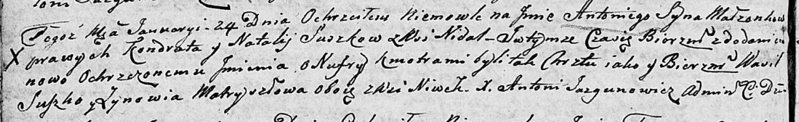

**Матрашило Франциск Лавренов (Matosiewicz Francisc)**

13 октября 1807 г -- крещение (НИАБ 937-4-32, лист 16об, №20/1807-р).

**НИАБ 937-4-32:** Лист 16об. **Метрическая запись №20/1807-р.**

{width="6.496527777777778in"
height="2.1680555555555556in"}

Дедиловичский костел Наисвятейшего Сердца Иисуса. 13 октября 1807 года.
Метрическая запись о крещении.

Matosiewicz Francisc -- сын крестьян с деревни Нивки.

Matosiewicz Łaurenti -- отец.

Matosiewiczowa Zennia -- мать.

Stralczonek Władysław -- крестный отец.

Buzowa Maria -- крестная мать, с деревни Нивки.

Zychowski Gabriel -- ксёндз, комендант Дедиловичский.
