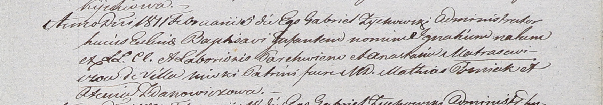

**Матрашило Игнатий Пархвенов (Matrasewicz Jgnati)**

5 февраля 1811 г -- крещение (НИАБ 937-4-32, лист 23, №2/1811-р).

**НИАБ 937-4-32:** Лист 23. **Метрическая запись №2/1811-р.**

{width="6.496527777777778in"
height="1.1430555555555555in"}

Дедиловичский костел Наисвятейшего Сердца Иисуса. 5 февраля 1811 года.
Метрическая запись о крещении.

Matrasewicz Jgnati -- сын крестьян с деревни Нивки.

Matrasewicz Parchwien -- отец.

Matrasewiczowa Anastasia -- мать.

Gozniak Mathias -- крестный отец, шляхтич.

Zdanowiczowa Axienia -- крестная мать.

Zychowski Gabriel -- ксёндз.
