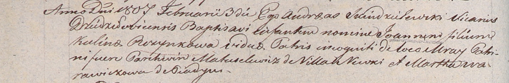

**Матрашило Пархвен (Matryszyło, Mateszutowski, Matuselewicz,
Matrasewicz Parachwien, Parchwien)**

7 апреля 1801 г -- крестный отец Барбары, дочери Сымона и Розалии
Кобердов с деревни Недаль (НИАБ 937-4-32, лист 4, №9/1801-р).

31 января 1804 г -- свидетель венчания молодого Яна Лаевского с деревни
Волоки с девкой Хведорой Матрашило с деревни Нивки (НИАБ 136-13-920,
лист 10, №2/1804-б (ориг)).

3 февраля 1807 г -- крестный отец Иоанна, незаконнорожденного сына
Пузынко Кулины с деревни Мрай (НИАБ 937-4-32, лист 14об, №4/1807-р).

5 февраля 1811 г -- крещение сына Игнатия (НИАБ 937-4-32, лист 23,
№2/1811-р).

**НИАБ 937-4-32:** Лист 4. **Метрическая запись №9/1801-р.**

{width="6.496527777777778in"
height="0.6854166666666667in"}

Дедиловичский костел Наисвятейшего Сердца Иисуса. 7 апреля 1801 года.
Метрическая запись о крещении.

Guberdowna Barbara -- дочь родителей с деревни Недаль.

Guberda Simoniusz -- отец.

Guberdowa Francisca -- мать.

Mateszutowski Parchwian -- крестный отец, с деревни Нивки.

Szpetkowna Mariana -- крестная мать, с деревни Нивки.

Linhart Hyacinthus -- ксёндз.

**НИАБ 136-13-920:** Лист 10. **Метрическая запись №2/1804-б (ориг).**

{width="6.496527777777778in"
height="1.3906288276465442in"}

Дедиловичская Покровская церковь. 31 января 1804 года. Метрическая
запись о венчании.

Łajеwski Jan -- жених, молодой, с деревни Волоки.

Matryszyłowa Chwiedora -- невеста, девка, с деревни Нивки.

Łajewski Nuprey -- свидетель, с деревни Волоки.

Matraszyła Parachwien -- свидетель.

Jazgunowicz Antoni -- ксёндз.

**НИАБ 937-4-32:** Лист 14об. **Метрическая запись №4/1807-р.**

{width="6.496527777777778in"
height="1.0597222222222222in"}

Дедиловичский костел Наисвятейшего Сердца Иисуса. 3 февраля 1807 года.
Метрическая запись о крещении.

Puzynko Joann -- незаконнорожденный сын.

Puzynkowa Kulina -- мать, с застенка Мрай.

Matuselewicz Parchwien -- крестный отец, с деревни Нивки.

Warawiczowa -- крестная мать, с деревни Пядань.

Skindzelewski Andreas -- ксёндз, викарий Дедиловичский.

**НИАБ 937-4-32:** Лист 23. **Метрическая запись №2/1811-р.**

{width="6.496527777777778in"
height="1.1430555555555555in"}

Дедиловичский костел Наисвятейшего Сердца Иисуса. 5 февраля 1811 года.
Метрическая запись о крещении.

Matrasewicz Jgnati -- сын крестьян с деревни Нивки.

Matrasewicz Parchwien -- отец.

Matrasewiczowa Anastasia -- мать.

Gozniak Mathias -- крестный отец, шляхтич.

Zdanowiczowa Axienia -- крестная мать.

Zychowski Gabriel -- ксёндз.
