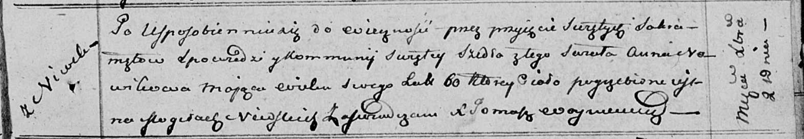

**Новик Анна (Nowikowa Anna)**

14 мая 1790 г -- крещение дочери Агрыпины (НИАБ 136-13-894, лист 9об,
№31/1790-р (ориг)), (РГИА 823-2-18, лист 240, №14/1790-р (коп)).

2 декабря 1811 г -- отпевание, умерла в возрасте 60 лет (родилась около
1751 г) (НИАБ 136-13-919, лист 23, №21/1811-у (ориг)).

**НИАБ 136-13-894:** Лист 9об. **Метрическая запись №31/1790-р (ориг).**

{width="6.496527777777778in"
height="1.0138046806649168in"}

Дедиловичская Покровская церковь. 14 мая 1790 года. Метрическая запись о
крещении.

Nowikowna Ahrypina -- дочь с деревни Нивки.

Nowik Daniła -- отец.

Nowikowa Anna -- мать.

Jacuk Chwiedor - кум.

Bautrukowa Katerzyna - кума.

Jazgunowicz Antoni -- ксёндз.

**РГИА 823-2-18:** Лист 240. **Метрическая запись №15/1790-р (коп).**

{width="6.496527777777778in"
height="1.538888888888889in"}

Дедиловичская Покровская церковь. 14 мая 1790 года. Метрическая запись о
крещении.

Nowikowna Ahrypina -- дочь родителей с деревни Нивки.

Nowik Daniło -- отец.

Nowikowa Anna -- мать.

Jacuk Chwiedor -- кум.

Bautrukowa Katarzyna - кума.

Jazgunowicz Antoni -- ксёндз.

**НИАБ 136-13-919:** Лист 23. **Метрическая запись №21/1811-у (ориг).**

{width="6.496527777777778in"
height="1.1277777777777778in"}

Осовская униатская церковь. 2 декабря 1811 года. Метрическая запись об
отпевании.

Nowikowa Anna -- умершая, 60 лет, с деревни Нивки, похоронена на
кладбище деревни Нивки.

Woyniewicz Tomasz -- ксёндз.
