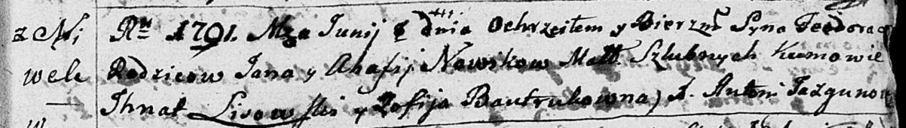

**Новик Агафия (Nowikowa Ahafia)**

1 июня 1791 г -- крещение сына Тодора (НИАБ 136-13-894, лист 13,
№22/1791-р (ориг)).

**НИАБ 136-13-894:** Лист 13. **Метрическая запись №22/1791-р (ориг).**

Дедиловичская Покровская церковь. 1 июня 1791 года. Метрическая запись о
крещении.

Nowik Teodor -- сын родителей с деревни Нивки.

Nowik Jan -- отец.

Nowikowa Ahafia -- мать.

Lisowski Jhnat - кум.

Bautrukowna Zofija - кума.

Jazgunowicz Antoni -- ксёндз.
