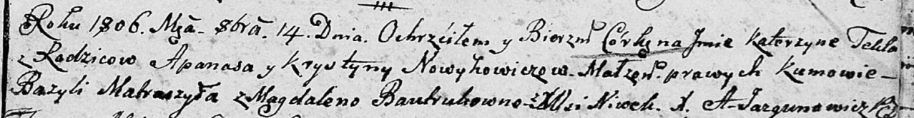

**Новикович Катерына Апанасова (Nowikowicz Katerzyna Tekla)**

14 октября 1806 г -- крещение (НИАБ 136-13-894, лист 61, №45/1806-р
(ориг)).

**НИАБ 136-13-894:** Лист 61. **Метрическая запись №45/1806-р (ориг).**

Дедиловичская Покровская церковь. 14 октября 1806 года. Метрическая
запись о крещении.

Nowikowiczowna Katerzyna Tekla -- дочь родителей с деревни Нивки.

Nowikowicz Apanas -- отец.

Nowikowiczowa Krystyna -- мать.

Matraszyła Bazyli -- кум.

Bautrukowna Magdalena -- кума.

Jazgunowicz Antoni -- ксёндз.
