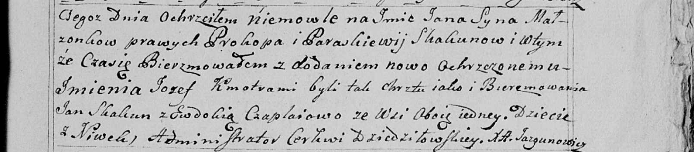

**Скакун Параскевия (Skakunowa Paraskewija)**

8 мая 1799 г -- крещение сына Яна Стефана (НИАБ 136-13-894, лист 39,
№21/1799-р (ориг)), (РГИА 823-2-18, лист 270, №21/1799-р (коп), НИАБ
136-13-938, лист 242, №20/1799-р (коп)).

**НИАБ 136-13-894:** Лист 39. **Метрическая запись №21/1799-р (ориг).**

{width="6.496527777777778in"
height="0.79790135608049in"}

Дедиловичская Покровская церковь. 8 мая 1799 года. Метрическая запись о
крещении.

Skakun Jan Stefan-- сын родителей с деревни Нивки.

Skakun Prokop -- отец.

Skakunowa Paraskiewija -- мать.

Skakun Jan-- кум.

Czaplaiowa Ewdokija -- кума.

Jazgunowicz Antoni -- ксёндз.

**РГИА 823-2-18:** Лист 270. **Метрическая запись №21/1799-р (коп).**

{width="6.496527777777778in"
height="1.9604166666666667in"}

Дедиловичская Покровская церковь. 8 мая 1799 года. Метрическая запись о
крещении.

Skakun Jan -- сын родителей с деревни Клинники \[Нивки\].

Skakun Prokop -- отец.

Skakunowa Paraska -- мать.

Skakun Jan -- кум.

Czaplaiowa Ewdokija -- кума.

Jazgunowicz Antoni -- ксёндз.

**НИАБ 136-13-938:** Лист 242. **Метрическая запись №20/1799-р (коп).**

(См. тж. НИАБ 136-13-894, лист 39, №21/1799-р (ориг); РГИА 823-2-18,
лист 270, №21/1799-р (коп))

{width="6.496527777777778in"
height="1.4326388888888888in"}

Дедиловичская Покровская церковь. 8 мая 1799 года. Метрическая запись о
крещении.

Skakun Jan Jozef \[Stefan\] -- сын родителей с деревни Нивки.

Skakun Prokop -- отец.

Skakunowa Paraskiewija -- мать.

Skakun Jan -- кум, с деревни Нивки.

Czaplaiowa Ewdokia - кума, с деревни Нивки.

Jazgunowicz Antoni -- ксёндз.
