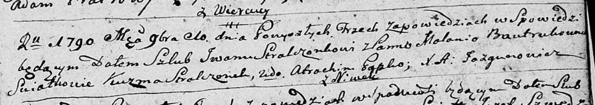

**Стрельчёнок (Бавтрук) Маланья (Stralczonkowa Małania z Bautrukow)**

10 ноября 1790 г -- венчание с Иваном Стрельчёнком с деревни Нивки (НИАБ
136-13-894, лист 69, №13/1790-б (ориг)).

**НИАБ 136-13-894:** Лист 69. **Метрическая запись №13/1790-б (ориг).**

Дедиловичская Покровская церковь. 10 ноября 1790 года. Метрическая
запись о венчании.

Stralczonek Jwan -- жених, с деревни Нивки.

Bautrukowna Małania -- невеста.

Stralczonek Kuźma -- свидетель.

Papko Atrachim -- свидетель.

Cierach Ławryn -- свидетель.

Jazgunowicz Antoni -- ксёндз.
