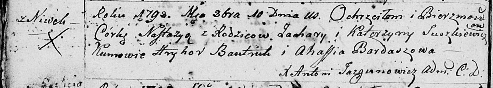
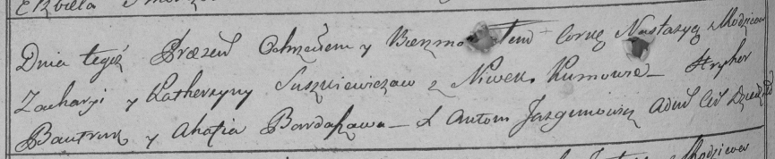

**Сушкевич Настасья Захарьева (Suszkiewiczwna Nastazya)**

10 октября 1798 г -- крещение (НИАБ 136-13-894, лист 37об, №54/1798-р
(ориг)), (РГИА 823-2-18, лист 266об, №55/1798-р (коп)).

**НИАБ 136-13-894:** Лист 37об. **Метрическая запись №54/1798-р
(ориг).**

Дедиловичская Покровская церковь. 10 октября 1798 года. Метрическая
запись о крещении.

Suszkiewiczowna Nastazya -- дочь родителей с деревни Нивки.

Suszkiewicz Zachary -- отец.

Suszkiewiczowa Katerzyna -- мать.

Bautruk Hryhor - кум.

Bardaszowa Ahafia - кума.

Jazgunowicz Antoni -- ксёндз.

**РГИА 823-2-18:** Лист 266об. **Метрическая запись №55/1798-р (коп).**

Дедиловичская Покровская церковь. 10 октября 1798 года. Метрическая
запись о крещении.

Suszkiewiczowna Nastazya -- дочь родителей с деревни Нивки.

Suszkiewicz Zachary -- отец.

Suszkiewiczowa Katerzyna -- мать.

Bautruk Hryhor -- кум.

Bardaszowa Ahafia -- кума.

Jazgunowicz Antoni -- ксёндз.
