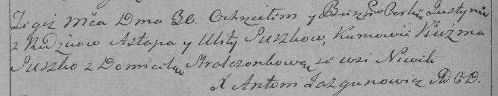

**Сушко Юстына Астапова (Suszkowna Justyna)**

30 сентября 1789 г -- крещение (НИАБ 136-13-894, лист 7об, №49/1789-р
(ориг)), (РГИА 823-2-18, лист 238об, №22/1789-р (коп)).

**НИАБ 136-13-894:** Лист 7об. **Метрическая запись №49/1789-р (ориг).**

{width="6.496527777777778in"
height="0.6537423447069116in"}

Дедиловичская Покровская церковь. 30 сентября 1789 года. Метрическая
запись о крещении.

Suszkowna Justyna -- дочь родителей с деревни Нивки.

Suszko \[Astap\] -- отец.

Suszkowa Ullyta -- мать.

Kuzma - кум.

Stralczenkowa Domicella - кума.

Jazgunowicz Antoni -- ксёндз.

**РГИА 823-2-18:** Лист 238об. **Метрическая запись №22/1789-р (коп).**

{width="6.496527777777778in"
height="1.2555555555555555in"}

Дедиловичская Покровская церковь. 30 сентября 1789 года. Метрическая
запись о крещении.

Suszkowna Justyna -- дочь родителей с деревни Нивки.

Suszko Astap -- отец.

Suszko Ulita -- мать.

Suszko Kużma -- кум.

Stralczonkowa Domicela - кума.

Jazgunowicz Antoni -- ксёндз.
