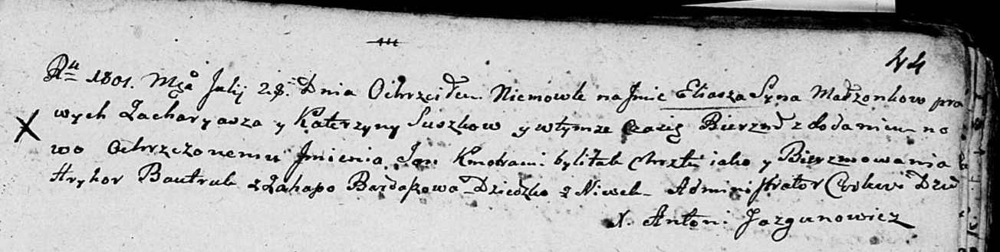

**Сушко Илья Захаров (Suszko Eliasz Jan)**

28 июля 1801 г -- крещение (НИАБ 136-13-894, лист 44, №17/1801-р
(ориг)).

**НИАБ 136-13-894:** Лист 44. **Метрическая запись №17/1801-р (ориг).**

Дедиловичская Покровская церковь. 28 июля 1801 года. Метрическая запись
о крещении.

Suszko Eliasz Jan -- сын родителей с деревни Нивки.

Suszko Zacharyasz -- отец.

Suszkowa Katerzyna -- мать.

Bautruk Hryhor -- кум.

Bardaszowa Ahapa -- кума.

Jazgunowicz Antoni -- ксёндз.
