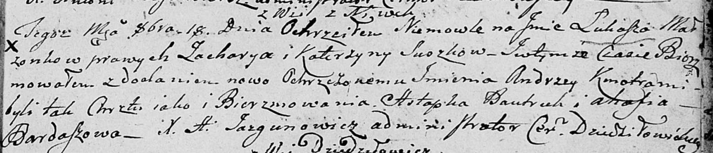

**Сушко Лукаш Захаров (Suszko Łukasz Andrzey)**

18 октября 1803 г -- крещение (НИАБ 136-13-894, лист 52, №44/1803-р
(ориг)).

**НИАБ 136-13-894:** Лист 52. **Метрическая запись №44/1803-р (ориг).**

{width="6.496527777777778in"
height="1.4000153105861768in"}

Дедиловичская Покровская церковь. 18 октября 1803 года. Метрическая
запись о крещении.

Suszko Łukasz Andrzey -- сын родителей с деревни Нивки.

Suszko Zachary -- отец.

Suszkowa Katerzyna -- мать.

Bautruk Astapka -- кум.

Bardaszowa Ahafia -- кума.

Jazgunowicz Antoni -- ксёндз.
