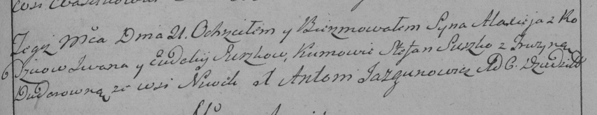

**Сушко Евдокия (Suszkowa Ewdokija)**

21 марта 1788 г -- крещение сына Алексея (НИАБ 136-13-894, лист 4,
№26/1788-р (ориг)), (РГИА 823-2-18, лист 236, №8/1788-р (коп)).

**НИАБ 136-13-894:** Лист 4. **Метрическая запись №26/1788-р (ориг).**

{width="6.496527777777778in"
height="0.6644706911636046in"}

Дедиловичская Покровская церковь. 21 марта 1788 года. Метрическая запись
о крещении.

Suszko Alexiej -- сын родителей (незаконнорожденный сын матери?) с
деревни Нивки.

Suszko ? -- отец.

Suszkowa Ewdokija -- мать.

Suszko Stefan - кум.

Dudaronkowa Fruzyna - кума.

**РГИА 823-2-18:** Лист 236. **Метрическая запись №10/1788-р (коп).**

{width="6.496527777777778in"
height="1.2534722222222223in"}

Дедиловичская Покровская церковь. 21 марта 1788 года. Метрическая запись
о крещении.

Suszko Alaxiey -- сын родителей с деревни Нивки.

Suszko Jwan -- отец.

Suszkowa Eudokija -- мать.

Suszko Stefan -- кум.

Dudarowna Fruzyna - кума.

Jazgunowicz Antoni -- ксёндз.
