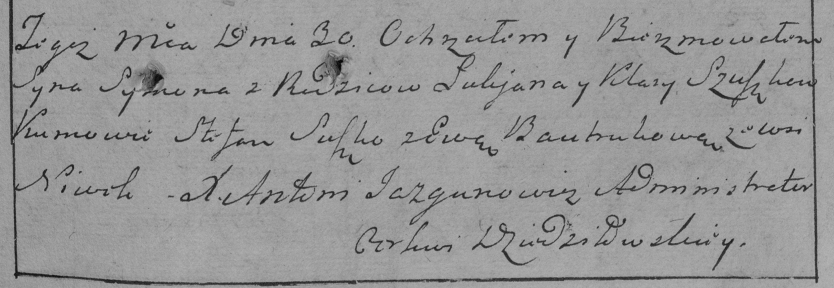

**Сушко Кляра (Szuszkowa Klara)**

30 января 1785 г -- крещение сына Сымона (РГИА 823-2-18, лист 228,
№3/1785-р (коп)).

**РГИА 823-2-18:** Лист 228. **Метрическая запись №3/1785-р (коп).**

{width="6.496527777777778in"
height="2.24375in"}

Дедиловичская Покровская церковь. 30 января 1785 года. Метрическая
запись о крещении.

Szuszko Symon -- сын родителей с деревни Нивки.

Szuszko Łukjan -- отец.

Szuszkowa Klara -- мать.

Suszko Stefan -- кум.

Bautrukowa Ewa - кума.

Jazgunowicz Antoni -- ксёндз.
