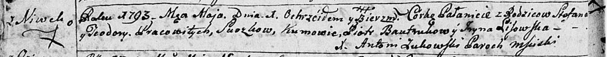

**Сушко Паланея Степанова (Suszkowna Pałanieia)**

10 мая 1793 г -- крещение (НИАБ 136-13-894, лист 19об, №40/1793-р
(ориг)).

**НИАБ 136-13-894:** Лист 19-об. **Метрическая запись №40/1793-р
(ориг).**

Дедиловичская Покровская церковь. 10 мая 1793 года. Метрическая запись о
крещении.

Suszkowa Palanieia -- дочь селян с деревни Нивки.

Suszko Stefan -- отец.

Suszkowa Teodora -- мать.

Bautrukow Piotr - кум.

Lisowska Jryna - кума.

Jazgunowicz Antoni -- ксёндз.
