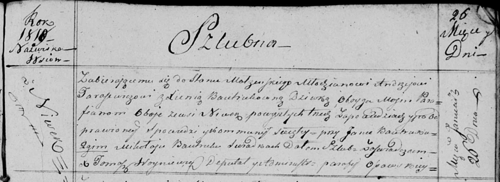

**Тарасевич Андрей (Tarasewicz Andrzey)**

26 января 1819 г -- венчание с девкой Ксеней Бавтрук с деревни Нивки
(НИАБ 136-13-920, лист 26, №2/1819-б (ориг)).

**НИАБ 136-13-894:** Лист 26. **Метрическая запись №2/1819-б (ориг).**

{width="6.496527777777778in"
height="2.369566929133858in"}

Осовская Покровская церковь. 26 января 1819 года. Запись о венчании.

Tarasewicz Andrzey -- жених, молодой, парафии Осовской, с деревни Нивки.

Bautrukowna Xienia -- невеста, девка, парафии Осовской, с деревни Нивки.

Bautruk Jan -- свидетель.

Bautruk Mikołay -- свидетель.

Woyniewicz Tomasz -- ксёндз.
