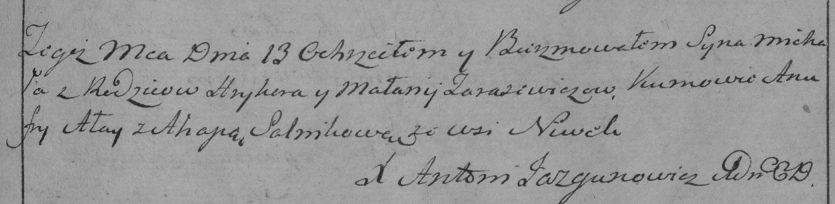

**Тарасевич Грыгор (Tarasewicz Hryhor)**

8 ноября 1797 г -- крещение сына Михала (НИАБ 136-13-894, лист 34об,
№64/1797-р (ориг)), (РГИА 823-2-18, лист 261, №45/1797-р (коп)).

**НИАБ 136-13-894:** Лист 34об. **Метрическая запись №64/1797-р
(ориг).**

{width="6.496527777777778in"
height="1.1365069991251093in"}

Дедиловичская Покровская церковь. 8 ноября 1797 года. Метрическая запись
о крещении.

Tarasewicz Michał -- сын родителей с деревни Нивки.

Tarasewicz Hryhor -- отец.

Tarasewiczowa Małanija -- мать.

Ałay ? - кум.

Salnikowa Ahapa - кума.

Jazgunowicz Antoni -- ксёндз.

**РГИА 823-2-18:** Лист 261. **Метрическая запись №45/1797-р (коп).**

{width="6.496527777777778in"
height="1.5875in"}

Дедиловичская Покровская церковь. 13 \[8\] ноября 1797 года. Метрическая
запись о крещении.

Tarasewicz Michał -- сын родителей с деревни Нивки.

Tarasewicz Hryhor -- отец.

Tarasewiczowa Małanija -- мать.

Ałay Anufry -- кум.

Salnikowa Ahapa -- кума.

Jazgunowicz Antoni -- ксёндз.
