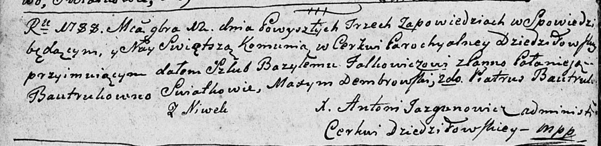

**Фалькович Базыль (Falkowicz Bazyl)**

12 ноября 1788 г -- венчание с Полонеей Бавтрук (НИАБ 136-13-894, лист
67об, №16/1788-б (ориг)).

**НИАБ 136-13-894:** Лист 67об. **Метрическая запись №16/1788-б
(ориг).**

Дедиловичская Покровская церковь. 12 ноября 1788 года. Метрическая
запись о венчании.

Falkowicz Bazyl -- жених, с деревни Нивки.

Bautrukowna Pałanieja -- невеста.

Dembrowski Maxym -- свидетель.

Bautruk Piatruś -- свидетель.

Jazgunowicz Antoni -- ксёндз.
