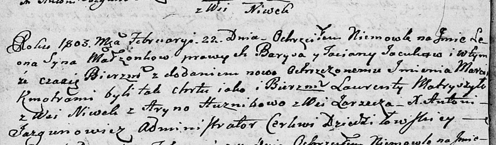

**Яцук Барыс (Jacuk Barys)**

22 февраля 1803 г -- крещение сына Леона Марцина (НИАБ 136-13-894, лист
49об, №6/1803-р (ориг)).

**НИАБ 136-13-894:** Лист 49об. **Метрическая запись №6/1803-р (ориг).**

Дедиловичская Покровская церковь. 22 февраля 1803 года. Метрическая
запись о крещении.

Jacuk Leon Marcin -- сын родителей с деревни Нивки.

Jacuk Barys -- отец.

Jacukowa Taciana -- мать.

Matryszyło Łaurenty -- кум, с деревни Нивки.

Huzniakowa Aryna -- кума, с деревни Заречье.

Jazgunowicz Antoni -- ксёндз.
