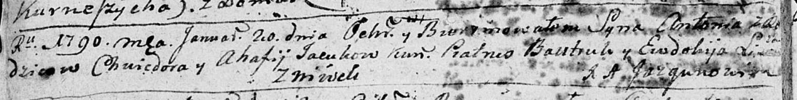
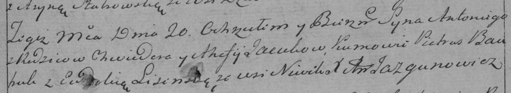

**Яцук Антон Хведоров (Jacuk Antoni)**

20 января 1790 г -- крещение сына Антона (НИАБ 136-13-894, лист 8об,
№55/1790-р (ориг)), (РГИА 823-2-18, лист 239, №2/1790-р (коп)).

**НИАБ 136-13-894:** Лист 8об. **Метрическая запись №5/1790-р (ориг).**

Дедиловичская Покровская церковь. 20 января 1790 года. Метрическая
запись о крещении.

Jacuk Antoni -- сын родителей с деревни Нивки.

Jacuk Chwiedor -- отец.

Jacukowa Ahafija -- мать.

Bautruk Piatruś - кум.

Li... Ewdokija - кума.

Jazgunowicz Antoni -- ксёндз.

**РГИА 823-2-18:** Лист 239. **Метрическая запись №3/1790-р (коп).**

Дедиловичская Покровская церковь. 20 января 1790 года. Метрическая
запись о крещении.

Jacuk Antoni -- сын родителей с деревни Нивки.

Jacuk Chwiedor -- отец.

Jacukowa Ahafija -- мать.

Bautruk Piatrus -- кум.

Lisowska? Eudokia - кума.

Jazgunowicz Antoni -- ксёндз.
