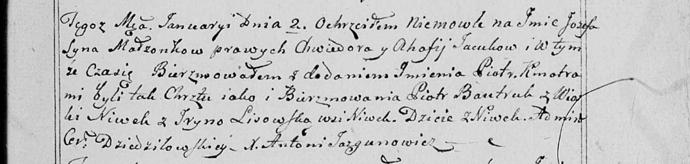

**Яцук Иосиф Хведоров (Jacuk Jozef Piotr)**

2 января 1799 г -- крещение (НИАБ 136-13-894, лист 38, №2/1798-р
(ориг)), (РГИА 823-2-18, лист 268, №2/1799-р (коп), НИАБ 136-13-938,
лист 240, №2/1799-р (коп)).

**НИАБ 136-13-894:** Лист 38. **Метрическая запись №2/1799-р (ориг).**

{width="6.496527777777778in"
height="1.0862193788276466in"}

Дедиловичская Покровская церковь. 2 января 1799 года. Метрическая запись
о крещении.

Jacuk Jozef Piotr -- сын родителей с деревни Нивки.

Jacuk Chwiedor -- отец.

Jacukowa Ahafija -- мать.

Bautruk Piotr -- кум с деревни Нивки.

Lisowska Ryna -- кума с застенка Нивки.

Jazgunowicz Antoni -- ксёндз.

**РГИА 823-2-18:** Лист 268. **Метрическая запись №2/1799-р (коп).**

{width="6.496527777777778in"
height="1.1694444444444445in"}

Дедиловичская Покровская церковь. 2 января 1799 года. Метрическая запись
о крещении.

Jacuk Jozef -- сын родителей с деревни Нивки.

Jacuk Chwiedor -- отец.

Jacukowa Ahafija -- мать.

Bautruk Piotr -- кум, с деревни Нивки.

Lisowska Jryna -- кума, с деревни Нивки.

Jazgunowicz Antoni -- ксёндз.

**НИАБ 136-13-938:** Лист 240. **Метрическая запись №2/1799-р (коп).**

(См. тж. НИАБ 136-13-894, лист 38, №2/1799-р (ориг); РГИА 823-2-18, лист
268, №2/1799-р (коп))

{width="6.496527777777778in"
height="1.5465277777777777in"}

Дедиловичская Покровская церковь. 2 января 1799 года. Метрическая запись
о крещении.

Jacuk Jozef Piotr -- сын родителей с деревни Нивки.

Jacuk Chwiedor -- отец.

Jacukowa Ahafija -- мать.

Bautruk Piotr -- кум, с деревни Нивки.

Lisowska Jryna - кума, с деревни Нивки.

Jazgunowicz Antoni -- ксёндз.
